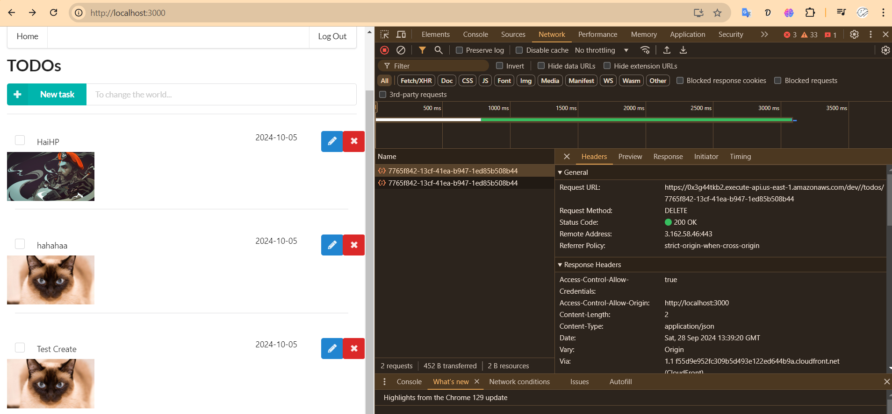
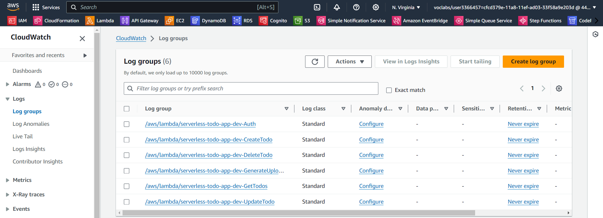

# 1) Functionality

The application allows users to create, update, delete TODO items

## API get

## API create

## API Update and upload a file

## API Delete

## App just allow only login user see content

## Authentication is implemented and does not allow unauthenticated access.

# Cloudformation

# Lambda

# Cloudwatch

# AuthAPP

